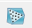
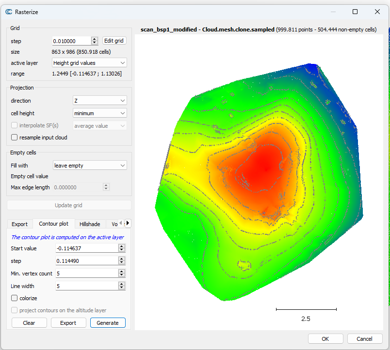

# CloudCompare - Step 2

Kontur & Querschnitt

## Kontur-Linien

### Unnötige Information (Bäume usw.) entfernen
1. Das File (scan_bsp1.las) herunterladen und öffnen
1. Bäume und unnötige Punkte entfernen:
    1. Zuerst mit `Plugin > CSF-Filter` versuchen 
    1. Wenn es nicht gut geht, mit Segment-Funktion manuell unnötige Information entfernen

### Öffnung schliessen
1. `Edit > Normals > Compute` 
1. `Edit > Mesh > Delaunay2.5 (XYPlane)` => Mesh erstellen
1. Erstellte "Mesh-Daten" markieren
1. `Sample points on a mesh` (auf Toolbar)  klicken
1. Im Popup-Fenster "Points Number" auswählen => Point Cloud erstellen

### Kontur-Linie erstellen
1. Die neu erstelle Point-Daten auswählen
1. `Tools > Projection > Rasterlization`> Popup-Fenster wird sich öffnen
1. Im Popup-Fenster den Wert in "Grid > step" zu "0.01" ändern
1. Im Popup-Fenster den Wert von "X" zu "Z" in "Projection > Direction" auswählen
1. Die Balken "Update grid" klicken => Raster-Fläche wird erstellt (Nicht das Popup-Fenster schliesse!!)
1. Das Tab "Contour plot" öffnen und die Zahl "step" (etwa 0.11), Line width (etwa 5) usw. justieren
1. "colorize" => Wenn die Konturen Farbe haben sollen
1. "Generate" klicken
1. Durch "Export" kann man die Konturen exportieren

### Querschnitt
1. Point-Daten aktivieren
1. `Tools > Segmentation > Extract sections` klicken
1. Linine ziehen (Punkte ansetzen mit Links-Mausklick, beenden mit Rechts-Mausklick)
1. `Create polyline ...` beenden, indem man den Button klickt
1. `Extract points along active sections`klicken

