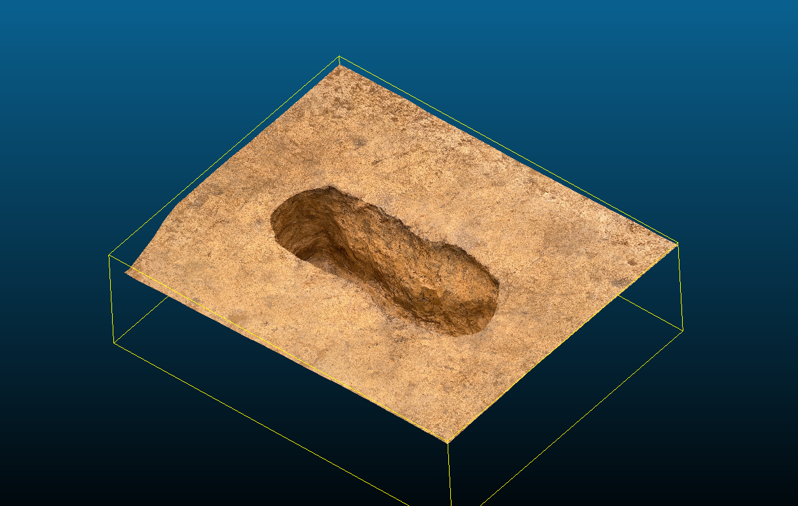
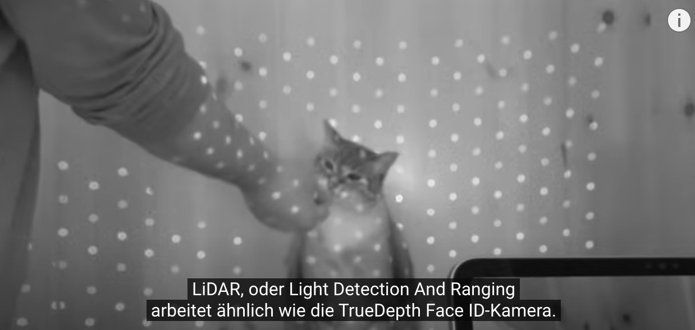

# Einführung Scaniverse

## 3D-scan und mobile Geräte

Für 3D-Scan gibt es nicht nur Scaniverse, sondern auch andere Apps für mobile Geräte vorhanden.
Hier eine Übersicht: 

# Zusammenfassung von 3D-Scan-Apps für Smartphones (für Anfänger)

| App           | [Scaniverse](https://scaniverse.com/)       | [Polycam](https://poly.cam/)           | [RealityScan](https://www.unrealengine.com/de/realityscan)       | [Luma 3D Capture](https://play.google.com/store/apps/dev?id=8889266027444065964&hl=de_CH)           |
|---------------|------------------|-------------------|-------------------|------------------|
| **Preis**     | Kostenlos        | Kostenlos         | Einige Funktionen kostenpflichtig | Kostenlos       |
| **Scan-Modus**| LiDAR + Fotogrammetrie + 3DGS (3D Gaussian Splatting) | LiDAR + Fotogrammetrie   | LiDAR + Fotogrammetrie + 3DGS | NeRF + 3DGS      |
| **iOS-kompatible Geräte** | iPhone 12–15 Pro/Pro MAX, iPad Pro (Modelle ab 2020) <br> *Fotogrammetrie + 3DGS*: iPhone 12–15/mini/Plus <br> *Fotogrammetrie*: iPhone XR/XS/XS Max | iPhones und iPads mit iOS 16 oder höher | iPhone 12–15 Pro/Pro MAX, iPad Pro (Modelle ab 2020) <br> *Fotogrammetrie*: iOS16-kompatible iPhones und iPads | Alle iPhones ab iPhone 11 (iOS 16.0 oder höher)<br> Unterstützung für iPads unklar |
| **Android-kompatible Geräte** | *Fotogrammetrie + 3DGS* <br> (unterstützte Geräte siehe HP) | ARCore-kompatible Geräte | *Fotogrammetrie + 3DGS* <br> (unterstützte Geräte siehe HP) | Unterstützt     |
| **Letztes Update** | Ver. 4.0.3 (24.10.2024) | Ver. 4.0.3 (05.12.2024) | Ver. 1.5.3 (04.11.2024) | Ver. 1.3.11 (30.10.2024) |
| **Exportformate** | Meshes: USDZ, FBX, OBJ, GLTF, STL <br> Punktewolken: PLY, LAS <br> 3DGS: PLY | Meshes: USDZ, OBJ, FBX, GLB, DAE, STL <br> Punktewolken: DXF, PLY, XYZ, PTS, LAS <br> 3DGS: PLY | Meshes: FBX, USDZ, GLB <br> 3DGS: PLY | Meshes: OBJ, GLTF, USDZ <br> 3DGS: PLY |
| **Video-Ausgabe** | Ja              | Ja                | Nein              | Ja               |
| **Verarbeitungsmodus** | Lokale Verarbeitung in allen Modi | Cloud-Verarbeitung | Lokale LiDAR-Verarbeitung <br> Cloud für andere Modi | Cloud-Verarbeitung |
| **Besonderheiten** | - Einfacher zu bedienen mit Funktionen von LiDAR-Scan bis Fotogrammetrie + 3DGS<br>- Unterstützt lokale Verarbeitung für *Fotogrammetrie + 3DGS*-Daten<br>- LiDAR-Scans ermöglichen eine schnelle Modellierung<br>- Unterstützt Export in 3DGS-Dateiformate<br> | - Unterstützt hochpräzise Fotogrammetrie und 3DGS<br>- Große Auswahl an Exportformaten<br>- Unterscheidet sich durch einfache Bedienbarkeit und ein flexibles Export-Interface | - Realistisch wirkende 3D-Modelle<br>- Unterstützt LiDAR- und Fotogrammetrie-basierte Modellierung<br>- Die Cloud-Verarbeitung ist bei hochdetaillierten Modellen unverzichtbar | - 3DGS (NeRF) ermöglicht extrem realistische 3D-Modelle<br>- Ideal für Anwendungen, bei denen fotorealistische Modelle gefragt sind<br>- Starke Render-Funktion für den professionellen Einsatz |
| **Empfohlene Anwendungsbereiche** | - Beste Wahl für Benutzer, die die kostenlosen Funktionen umfassend nutzen möchten<br>- Ideal für Benutzer mit Interesse an LiDAR-Scans | - Ideal für hochpräzise Fotogrammetrie<br>- Optimal für Benutzer, die 3D-Modelle exportieren müssen | - Empfohlen für Benutzer, die Wert auf realistische Modelle legen<br>- Unterstützt komplexe Modellierungsprojekte | - Geeignet für Nutzer, die fotorealistische Ergebnisse wünschen<br>- Empfohlen für professionelle Content-Erstellung |

(Ursprünglich Erstellt von [iwama](https://x.com/iwamah1?lang=de) (Stand: 2024-05-28); Danach von mir ergänzt)


## Unterschiedliche Technologie von 3D-Scan

### Fotogrametrie

Die wahrscheinlich meist verbreitete Methode zur Erstellung des 3D-Models. Ein 3D-Polygon wird dabei aus mehreren Perspektivbildern hergestellt. Dabei werden aus den Bildern ähnliche Punkte identifiziert, um Punktwolkendaten (Point Cloud) zu erzeugen. Diese Punktwolke wird anschließend in eine Ansammlung von nicht überlappenden Dreiecken unterteilt, um ein Mesh zu erstellen. Basierend auf den Farbinformationen der Fotos wird dann eine Textur auf die Oberfläche des Meshes aufgebracht, um ein 3D-Modell zu erzeugen.

Bei Fotogrametrie ist es schwierig, 3D-Modelle von flachen Objekten ohne auffällige Merkmale, schwarzen Oberflächen, transparentem Glas, Wasserflächen oder reflektierenden Materialien zu erstellen. Da die 3D-Erstellung auf der Identifizierung ähnlicher Punkte basiert, wird außerdem eine große Anzahl von Fotos benötigt

### NeRF (Neural Radiance Fields)

NeRF (Neural Radiance Fields) ist ein ML-Modell (Machine-Lerning-Modell), das 2020 vorgestellt wurde (Mildenhall u.a. 2020). Es handelt sich um ein Modell zur freien Bildgenerierung, das Szenen aus mehreren Perspektivbildern in die Gewichtungen eines maschinellen Lernmodells umwandelt und Bilder ähnlich wie beim Raytracing rendert.

Das Modell nimmt die Kameraposition und die Blickrichtung als Eingabe und gibt basierend auf der volumetrischen Dichte (≈ Transparenz) und der Strahlungsintensität (≈ RGB) das Bild aus dieser Perspektive aus. Indem die Parameter dieser Eingabe-Ausgabe-Transformation durch ein neuronales Netzwerk trainiert werden, wird das Modell an die ursprünglichen Bilder angenähert und eine 3D-Szene erzeugt.

Dieses Verfahren dient weniger der Erstellung von 3D-Modellen als vielmehr der Generierung von Bildern aus beliebigen Perspektiven. Da volumetrische Dichte und Strahlungsintensität für jede Perspektive gelernt werden, können auch reflektierende und transparente Objekte dargestellt werden, die für die Photogrammetrie schwierig zu erfassen sind. Zudem können komplette Szenen, einschließlich des Hintergrunds, als 3D-Modell dargestellt werden.

Ein Nachteil dieses Verfahrens ist jedoch der hohe Rechenaufwand (≈ Zeit) sowohl für das Training als auch für das Rendering.

[Github-Repo "bmild/nerf"](https://github.com/bmild/nerf)

Artikel: 
Mildenhall, Ben [u.a.] (2020): NeRF: Representing Scenes as Neural Radiance Fields for View Synthesis.
https://doi.org/10.48550/arXiv.2003.08934


### LiDAR (Light Detection And Ranging)

LiDAR ist eine Methode zur optischen Abstands- und Geschwindigkeitsmessung sowie zur Fernmessung. Die Methode ist nicht nur zum Zweck des 3D-Scans verwendet, sondern auch für die Abstandsmessung beim Fahrzeug und darüber hinaus in der Steuerung und Navigation autonomer Fahrzeuge eingesetzt. Deshalb gilt LiDAR im Allgemein nicht als reine 3D-Aufnahme-Technick. 
Die Bezeichnung LiDAR in der oberen Tabelle bedeutet jedoch eine Scan-Methode, in der 3D-Modell mit Hilfe von LiDAR-Funktion des iPhones/iPads erstellt wird.


### 3DGS (3D Gaussian Splatting)
3DGS ist ein noch neueres ML-Modell, das 2023 vorgestellt wurde. Ähnlich wie bei der Photogrammetrie erzeugt 3DGS eine Punktwolke aus Bildern aus mehreren Perspektiven. Diese Punktwolke wird jedoch mit dreidimensionalen Gaußschen Verteilungen versehen, die bestimmte Parameter tragen, um eine 3D-Darstellung zu ermöglichen.

Die Methode ergänzt die Punktwolke mit 3D-Gaussianen und verändert deren Parameter (Position, Skalierung, Farbe, Transparenz). Durch maschinelles Lernen werden diese Parameter so optimiert, dass die Darstellung aus jeder Perspektive möglichst genau mit den Referenzbildern übereinstimmt, wodurch eine 3D-Szene erzeugt wird.

3DGS generiert wie NeRF Szenen und bietet daher eine höhere Ausdrucksstärke im Vergleich zur Photogrammetrie. Obwohl für das Training maschinelles Lernen erforderlich ist, erfolgt das Rendering selbst nur auf Basis der trainierten Parameter, was eine schnelle Rendering-Geschwindigkeit ermöglicht.

Ein Nachteil ist jedoch, dass das Training, wie auch bei NeRF, zeitaufwändig ist.

... [Hier](https://huggingface.co/blog/gaussian-splatting) gibt es noch eine ausführliche Erläuterung...

...Und ein Beispielbild:
![](https://cdn-lfs.hf.co/datasets/huggingface/documentation-images/b66564ce7b2a32c5cf787135abbf1e241f1d49aa9773cd22a866c3361cc5f718?response-content-disposition=inline%3B+filename*%3DUTF-8%27%27ellipsoids.png%3B+filename%3D%22ellipsoids.png%22%3B&response-content-type=image%2Fpng&Expires=1733868611&Policy=eyJTdGF0ZW1lbnQiOlt7IkNvbmRpdGlvbiI6eyJEYXRlTGVzc1RoYW4iOnsiQVdTOkVwb2NoVGltZSI6MTczMzg2ODYxMX19LCJSZXNvdXJjZSI6Imh0dHBzOi8vY2RuLWxmcy5oZi5jby9kYXRhc2V0cy9odWdnaW5nZmFjZS9kb2N1bWVudGF0aW9uLWltYWdlcy9iNjY1NjRjZTdiMmEzMmM1Y2Y3ODcxMzVhYmJmMWUyNDFmMWQ0OWFhOTc3M2NkMjJhODY2YzMzNjFjYzVmNzE4P3Jlc3BvbnNlLWNvbnRlbnQtZGlzcG9zaXRpb249KiZyZXNwb25zZS1jb250ZW50LXR5cGU9KiJ9XX0_&Signature=bH0YLcw6HgcdFlsv0l1bPeXv3WU0ON%7EhRzjY2RMiNUJAvFWt0MKbwGlZYkADTwcrix7dm-bzjZrrS2a3W-c6cGgUfhRb757CIjrcAWh2wIq%7EyfHXpADoeCNl3YcvFanG8SeMqnhdMNecxJejwvzvtSqRlXP-Zwtb%7EIBHde6ucsOfGscN0ZegW2tNX9fHlDK%7EBkm2DwZ0kJHeEBoVfqOKPhSojOnJVGQtTQ0lZa%7EqoehC5u7JJ13KxmO6vSrmXyjxQAI2vDd4%7ERDRzjmNQtL9ZtUXweH8-jfnrLR5cGqqi--cUpkGlMjjOSPykRogmhrMJOp9%7EhKTTIqBlLR7VC5nvQ__&Key-Pair-Id=K3RPWS32NSSJCE)


## 3D-Modell für Wissenschaft?

3D-Modelle, die durch Fotogrametrie oder LiDAR erzeugt werden, sind heute bereits in Forschung, Bauwesen und Vermessung verwendet. (s. [Swisstopo zu Fotogrametrie](https://www.swisstopo.admin.ch/de/fotogrammetrie) für Kartographie, [3D-Museum an der Uni Tübingen](https://www.unimuseum.uni-tuebingen.de/de/sammlungen/3d-museum) für Archäologie)



```
Dieses 3D-Modell (obj-file)  wurde durch Scaniverse erstellt
title: 縄文時代陥し穴（SK3519J）（観測日2022年8月26日）
location: 東京都
license: CC BY 4.0 国分寺市
```

### Wie gut/schlecht ist LiDAR in mobilen Geräten?


Aus YouTube-Video [12,9” iPad Pro 2020 Teardown: Wie sieht der LiDAR-Scanner aus?](https://youtu.be/xz6CExnGw9w?feature=shared) von iFixit

Lichtstrahl von iPad Pro 2020 ist nicht so dicht wie die anderen LiDAR-Scan-Geräte. Ausserdem reicht die Strahlung höchstens 5m. Aber Preisunterschied ist dennnoch gross. Eva Lite von Artec 3D kostet z.B. 6700 EURO.

Ausserdem hat iPhone/iPad nur GPS, um den Standort zu ermessen. Um noch genauere Standpunkte herausfinden, braucht man noch Ergänzung mit Hilfe von z.B. [GNSS](https://de.wikipedia.org/wiki/Globales_Navigationssatellitensystem).

Kurz gesagt, kann iPhone/iPad-Gerät mit LiDAR für 3D-Aufnahme nur dann verwendet werden, wenn die Gegenstände genug klein sind und näher stehen.
Auf der anderen Seite haben die solche mobilen Geräten Vorteil für die Ermessung der Innenseite eines Objektes mit kleiner Öffnung.  


## Warum Scaniverse?

In diesem Workshop benutzen wir die App "Scaniverse" aus folgenden Gründen:

1. Die App ist kostenlos und bietet viele Scan-Methode an. 
1. Die Datenverarbeitung bei der 3D-Kreation verläuft lokal (innerhalb eines mobilen Gerätes). 
1. Sie ist sowohl bei iPhone/iPad als auch die Geräte mit Android verfügbar. (Allerdings bestimmte Funktionen sind nicht bei allen Geräten anwendbar)
1. Benutzerfreundliches UI


