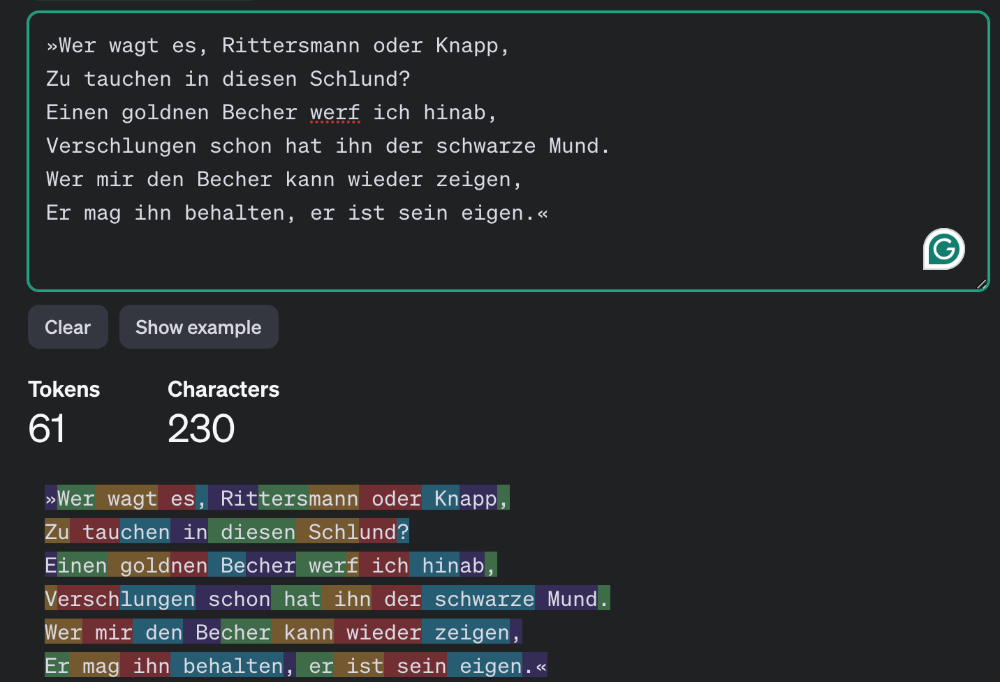

# Workshop Spielen mit LLM part 1: Chatbot bauen

In diesem Workshop lernt man: 

1. Grundsätzliche Elemente für Chatbot wie Token/Kontext window usw. 
1. Wie man mit der API-Schnittstelle umgeht
1. Wie man Request für Chat Completions formuliert

## LLM Models bei OpenAI (Stand: 01.10.2023)

Siehe auch [Overviews von OpenAI](https://platform.openai.com/docs/models/overview)

| Model | Description | context window |
|-------|-------------|----------------|
| GPT-4o | high-intelligence flagship model for complex, multi-step tasks | 128,000 tokens |
| GPT-4o mini | affordable and intelligent small model for fast, lightweight tasks | 128,000 token |
| GPT-4 Turbo | The previous set of high-intelligence models | 128,000 tokens |
| GPT-3.5 Turbo | A fast, inexpensive model for simple tasks| 16,385 tokens |

__Preise__
siehe [hier](https://openai.com/api/pricing/)

## Tokens?

1 Token ist nicht 1 Wort!

Selber ausprobieren:
[OpenAI Tokenizer](https://platform.openai.com/tokenizer)

## Notebooks

Einstieg:
[Link zu Colab](https://colab.research.google.com/drive/1SPlPZWb3gvMIDI5tuuQ53zzz9LEna_ey?usp=sharing)

Chatbot mit Gradio:
[Link zu Colab](https://colab.research.google.com/drive/1WOsd0-_A97lkrgRnysENTDNSjUc6d-HQ?usp=sharing)