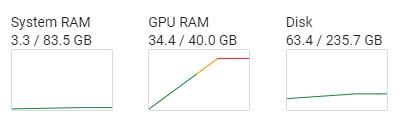
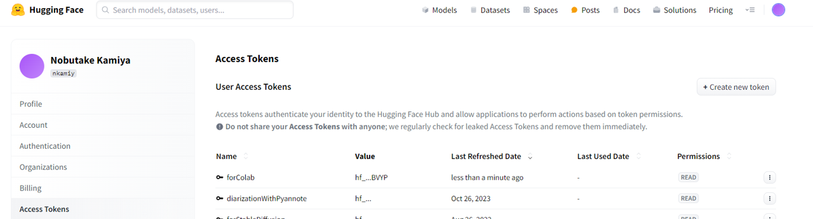
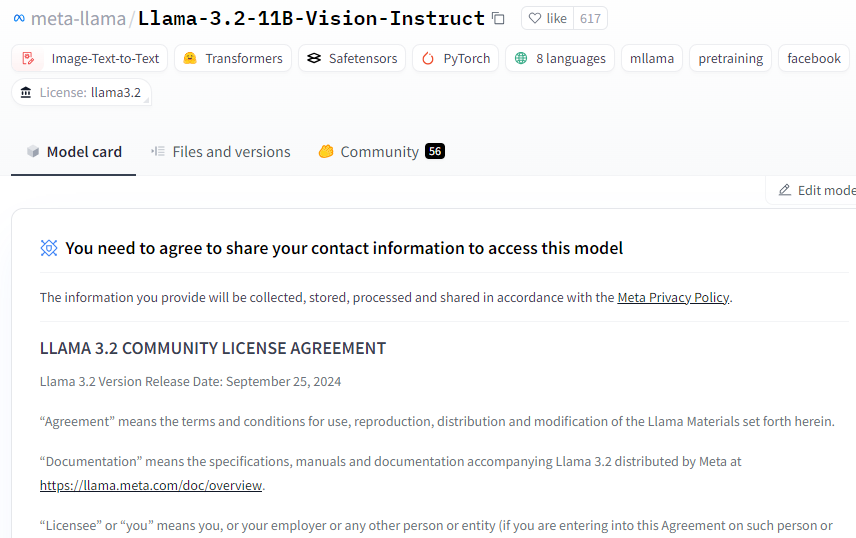
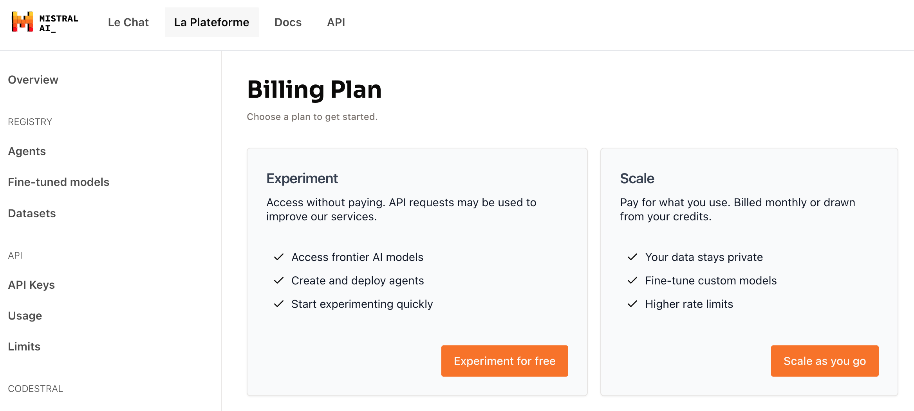

# Workshop Spielen mit LLM part 2

In diesem Workshop lernt man: 

1. VLM (Vision-Language-Model), wie GPT-4o-mini, kennenlernen
1. Eigene Anwendung mit LLM oder VLM planen und programmieren
1. Unterschiedliche LLMs kennenlernen
1. Eventuell kann man die für Digital Humanities essentiellen Technologie wie IIIF kennenlernen 


## Beispiele

### VLM (GPT-4o-mini) und Structured Output
[Notebook-beispiel](https://colab.research.google.com/drive/1JUBrPdwjDWxceEiQ_LTj65fLHzZ7k5vh?usp=sharing)

### VLM (GPT-4o-mini) und JSON-output
[Notebook-Beispiel](https://colab.research.google.com/drive/1RPx9y5Vf0KqidHa_D-PjQ-Tnu1vgQUEv?usp=sharing)


### GraphRAG mit Langchain
[Notebook-Beispiel](https://colab.research.google.com/drive/1oqTaqJiOqm94kB2j-837Qnk47XeaiybX?usp=sharing)


### Andere LLMs


#### 


[Notebook-Beispiel](https://colab.research.google.com/drive/1XPUyZpQJkzsosHqDO45ZWIrmnvHi0cN1?usp=sharing)

##### Zu Molmo

>Molmo is a family of open vision-language models developed by the Allen Institute for AI. Molmo models are trained on PixMo, a dataset of 1 million, highly-curated image-text pairs. It has state-of-the-art performance among multimodal models with a similar size while being fully open-source. You can find all models in the Molmo family here. Learn more about the Molmo family in our announcement blog post or the paper.
>MolmoE-1B is a multimodal Mixture-of-Experts LLM with 1.5B active and 7.2B total parameters based on OLMoE-1B-7B-0924. It nearly matches the performance of GPT-4V on both academic benchmarks and human evaluation, and achieves state-of-the-art performance among similarly-sized open multimodal models.

##### GPU 
Um ein Model Molmo (hier MolmoE 1B) auf Colaboratory zu betätigen, braucht man GPU (Tesla A100) für Runtime, weil A100 am meisten RAM hat.
Die anderen GPU haben folgende RAM-Kapazität:

- Tesla A100 : 40GB
- Tesla V100 : 16GB
- Tesla P100 : 16GB 
- Tesla K80 : 12GB

Um GPU für Runtime zu ändern: "Runtime" > "Change runtime type" > "A100"

Als ich MolmoE 1B auf Colab betätigt habe, hat das Model 34.4 GB RAM gebraucht:




#### LLM durch Huggingface-PipeLine von Langchain

[Notebook-Beispiel mit Gemma](https://colab.research.google.com/drive/1kWYFrTCEpdEIULwSiJPhQEmnz9qY3IMW#scrollTo=DV7SZMtUCLXX)

[Huggingfache]() bietet sehr viele KI-Models an. Diese Model kann man über Huggingface-PipeLine geholt werden.

1. Dafür zuerst einen Account von Huggingface erstellen
1. Dann ein Access-Token von Huggingface erstellen (wie unten)



3. Eventuell Agreement für ein Model abschliessen (siehe unten)




Das Access-Token in Colaboratory eingeben ... wie immer.
Danach dieses Token in Umgebungsvariable "HUGGING_FACE_HUB_TOKEN" eintragen:

```
from google.colab import userdata
import os

os.environ["HUGGING_FACE_HUB_TOKEN"] = userdata.get("[secretName von deinem Token]")
```

#### LLM durch API (Mistral AI)

[Notebook-Beispiel](https://colab.research.google.com/drive/1oefH9jG9DbBGMBK1sH2HDxMtWNFW4xWQ?usp=sharing)

__Mistral AI?__

>Mistral AI ist ein französisches Softwareunternehmen, das sich mit künstlicher Intelligenz (KI, englisch Artificial Intelligence, kurz AI) beschäftigt und unter den europäischen Unternehmen der Branche führend im Bereich Großer Sprachmodelle ist.
Mistral AI entwickelt vor allem Open-Source-Sprachmodelle. Die nacheinander veröffentlichten Modelle Mistral 7B und Mixtral 8x7B wurden Ende 2023 unter Apache-2.0-Lizenz freigegeben. (Wikipedia)

Mistral AI bietet auch API-Schnittstelle an:



Dabei gibt es kostenfreie Option - Dabei kann die Datei für Training des Modells verwendet werden...


#### Quantization

[Notebook-Beispiel mit GGUF](https://colab.research.google.com/drive/1DwOWyrC6m5Yz7cwfKofodKaJZgaCdqiv?usp=sharing)

Hier verwenden wir [quantized Llama](https://huggingface.co/hugging-quants/Llama-3.2-3B-Instruct-Q4_K_M-GGUF).

```
(Antwort von Llama auf die Frage zu Quantization)
A very interesting topic!

Quantization of a Large Language Model (LLM) refers to the process of reducing the computational resources required to run a large neural network, such as a LLM, by converting its weights and activations to a lower precision data type.

In traditional floating-point computing, LLMs are typically implemented using 32-bit or 16-bit floating-point numbers, which can store values with a very high degree of precision. However, these high-precision representations come at a cost:

1. **Increased memory usage**: More bits mean more memory is required to store the weights and activations, which can lead to larger model sizes and increased memory usage.
2. **Increased computational overhead**: Floating-point operations are generally slower and more expensive than integer arithmetic.

Quantization reduces the precision of the model's weights and activations from floating-point to lower-precision integers, such as:

* **Fixed-point**: Weights and activations are represented using fixed-point numbers, with a fixed number of bits for the mantissa (fractional part) and an integer exponent.
* **Integer quantization**: Weights and activations are represented using integers, with a fixed number of bits for each component.
* **Binary quantization**: Weights and activations are represented using binary values (0s and 1s) with some additional precision.

By reducing the precision of the model, quantization:

1. **Reduces memory usage**: Smaller weights and activations require less memory, making the model more efficient and easier to store.
2. **Simplifies computations**: Integer arithmetic is generally faster and less expensive than floating-point operations, leading to faster inference and training.
3. **Improves hardware efficiency**: Many modern hardware platforms, such as GPUs and TPUs, are designed to handle integer arithmetic more efficiently than floating-point operations.

However, quantization can also lead to some trade-offs, such as:

1. **Loss of precision**: Reducing the precision of the model's weights and activations can lead to decreased model accuracy and performance.
2. **Increased risk of overflow and underflow**: With reduced precision, the model may be more susceptible to overflow or underflow errors, especially when dealing with large or very small values.

To mitigate these trade-offs, researchers and practitioners use various quantization techniques, such as:

1. **Weight quantization**: Only quantizing the weights, leaving the activations at full precision.
2. **Activation quantization**: Only quantizing

```


### Sonstige Anwendung

- Nachricht automatisch in Teams-Kanal pushen (mit Incoming Webhook)

    [Notebook-Beispiel](https://colab.research.google.com/drive/1fP1qlikDaWQaFBHAc7Y66E-u7VK-bnVB?usp=sharing)


